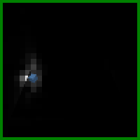

# TextOCVP: Text-Conditioned Object-Centric Video Prediction

Official implementation of: *Object-Centric Image to Video Generation with Language Guidance*  by [Angel Villar-Corrales](http://angelvillarcorrales.com/templates/home.php), [Gjergj Plepi](https://www.linkedin.com/in/gjergj-plepi-928a4b196/) and [Sven Behnke](https://www.ais.uni-bonn.de/behnke/). ArXiv Preprint. 2025.


[[`Paper`](https://arxiv.org/abs/2502.11655)]
&nbsp;&nbsp; 
[[`Project Page`](https://play-slot.github.io/TextOCVP/)]
&nbsp;&nbsp; 
[[`BibTeX`](http://angelvillarcorrales.com/templates/others/bibtex_TextOCVP.php)]


<table>
  <tr>
    <td align="center">
      <b>TextOCVP</b>
      <br>
    </td>
    <td align="center">
        <b>Text-Conditioned Predictor</b>
        
    </td>
  </tr>
</table>


<table>
  <tr>
    <td align="center">
        <span style="font-size: 75%; line-height:0.5;"><code>the medium green rubber cone covers the gold snitch. the large purple rubber cone is picked up and placed to (-1, 3).</code><span>
        
    </td>
    <td align="center">
        <span style="font-size: 75%; line-height:0.5;"><code>the large yellow rubber cone is sliding to (2, 3). the small gold metal snitch is picked up and placed to (-3, 1).</code><span>
        
    </td>
    <td align="center">
        <span style="font-size: 75%; line-height:0.5;"><code> the medium green metal sphere is sliding to (2, 1). the small brown metal cube is picked up and placed to (-3, 1).</code><span>
        
    </td>
  </tr>
</table>


## Installation and Dataset Preparation

1. Clone the repository and install all required packages including in our ```conda``` environment:
```
git clone git@github.com:angelvillar96/TextOCVP.git
cd TextOCVP
conda env create -f environment.yml
```


2. Download and extract the pretrained models, including checkpoints for the SAVi decomposition, predictor modules and behaviour modules:
```
chmod +x download_pretrained.sh
./download_pretrained.sh
```


3. Download the datasets and place them in the `datasets` folder. 

 - **CATER:** You can download the CATER dataset from the links provided in the original
  [MAGE](https://github.com/Youncy-Hu/MAGE) repository:
  &nbsp;&nbsp;
  [CATER Easy](https://drive.google.com/drive/folders/1ICIP5qY1rTod-hTLz5zJSxlbrHrGrdt4)
  &nbsp;&nbsp;
  [CATER Hard](https://drive.google.com/drive/folders/1xJM7gNDCslpM8MJNYT1fqgiG8yyIl6ue)

 - **CLIPort:** Contact the authors at `villar@ais.uni-bonn.de` to get access to this data.


## Training

We refer to [docs/TRAIN.md](/assets/docs/TRAIN.md) for detailed instructions for training TextOCVP.
We include instructions for all training stages, including training the Object-Centric Video Decomposition model,
as well as training the Text-Conditioned predictor.

Additionally, we provide [instructions](/assets/docs/YOUR_DB.md) on how to support your own dataset.


## Evaluation and Figure Generation

We provide bash scripts for evaluating and generating figures using our pretrained checkpoints. <br>
Simply run the bash scripts by:

```
./scripts/SCRIPT_NAME
```

**Example:**

```
./scripts/05_evaluate_TextOCVP_CATER.sh 
./scripts/06_generate_figs_pred_CATER.sh

./scripts/05_evaluate_TextOCVP_CLIPORT.sh 
./scripts/06_generate_figs_pred_CLIPORT.sh
```

Below we discuss in more detail the different evaluation and figure generation scripts and processes.


### Evaluate Object-Centric Model for Video Decomposition

You can quantitatively and qualitatively evaluate an object-centric video decomposition model, i.e. SAVi or ExtendedDINOSAUR, using the `src/03_evaluate_decomp_model.py` and `src/06_generate_figs_decomp_model.py` scripts, respectively.

This scrips will evaluate the model on the test set and generate figures for the results.

**Example:**
```
python src/03_evaluate_decomp_model.py \
    -d experiments/TextOCVP_CLIPort/ \
    --decomp_ckpt ExtendedDINOSAUR_CLIPort.pth \
    --results_name results_DecompModel

python src/06_generate_figs_decomp_model.py \
    -d experiments/TextOCVP_CLIPort/ \
    --decomp_ckpt ExtendedDINOSAUR_CLIPort.pth \
    --num_seqs 10
```

<details>
    <summary><i>Show Object-Centric Decomposition Figures</i></summary>
    
    
</details>


### Evaluate TextOCVP for Object-Centric Image-to-Video Generation


You can quantitatively evaluate TextOCVP for video prediction using the `src/05_evaluate_predictor.py` script.
This script takes pretrained Object-Centric Decomposition and TextOCVP checkpoints and evaluates the visual quality of the predicted frames.


**Example:**
```
python src/05_evaluate_predictor.py \
    -d experiments/TextOCVP_CLIPort/ \
    --decomp_ckpt ExtendedDINOSAUR_CLIPort.pth \
    --name_pred_exp TextOCVP \
    --pred_ckpt TextOCVP_CLIPort.pth \
    --results_name results_TextOCVP_NumSeed=1_NumPreds=19 \
    --num_seed 1 \
    --num_preds 19 \
    --batch_size 8
```

<br>

Similarly, you can qualitatively evaluate the models using the `src/06_generate_figs_predictor.py` script.


**Example:**
```
python src/06_generate_figs_predictor.py \
    -d experiments/TextOCVP_CLIPort/ \
    --decomp_ckpt ExtendedDINOSAUR_CLIPort.pth \
    --name_pred_exp TextOCVP \
    --pred_ckpt TextOCVP_CLIPort.pth \
    --num_preds 29 \
    --num_seqs 10
```


<details>
    <summary><i>Show Example Outputs of `src/06_generate_figs_predictor.py`</i></summary>
    Generating figures with TextOCVP should produce animations as follows:
    <br>
    </table>
      <tbody>
      <tr>
        <td align="center">
          
        </td>
        <td align="center">
          
        </td>
        <td align="center">
          
        </td>
        <td align="center">
          
        </td>
        <td align="center">
          
        </td>
        <td align="center">
          
        </td>
        <td align="center">
          
        </td>
        <td align="center">
          
        </td>
      </tr>
      <br>
      <tr>
        <td align="center">
          
        </td>
        <td align="center">
          
        </td>
        <td align="center">
          
        </td>
        <td align="center">
          
        </td>
        <td align="center">
          
        </td>
        <td align="center">
          
        </td>
        <td align="center">
          
        </td>
        <td align="center">
          
        </td>
      </tr>
      </tbody>
    </table>
</details>


## Related Works

If you consider our work interesting, you may also want to check out our related works:
 - [OCVP](https://sites.google.com/view/ocvp-vp): Object-Centric Video Prediction via decoupling object dynamics and interactions.
 - [SOLD](https://slot-latent-dynamics.github.io/): Model-based reinforcement learning with object-centric representations.
 - [PlaySlot](https://play-slot.github.io/PlaySlot/): Learning inverse dynamics for controllable object-centric video prediction and planning.


## Contact and Citation

This repository is maintained by [Angel Villar-Corrales](http://angelvillarcorrales.com/templates/home.php) and [Gjergj Plepi](https://www.linkedin.com/in/gjergj-plepi-928a4b196/).


Please consider citing our paper if you find our work or repository helpful.

```
@article{villar_TextOCVP_2025,
  title={Object-Centric Image to Video Generation with Language Guidance},
  author={Villar-Corrales, Angel, and Plepi, Gjergj and Behnke, Sven},
  journal={arXiv preprint arXiv:2502.11655},
  year={2025}
}
```

In case of any questions or problems regarding the project or repository, do not hesitate to contact the authors at `villar@ais.uni-bonn.de`.
